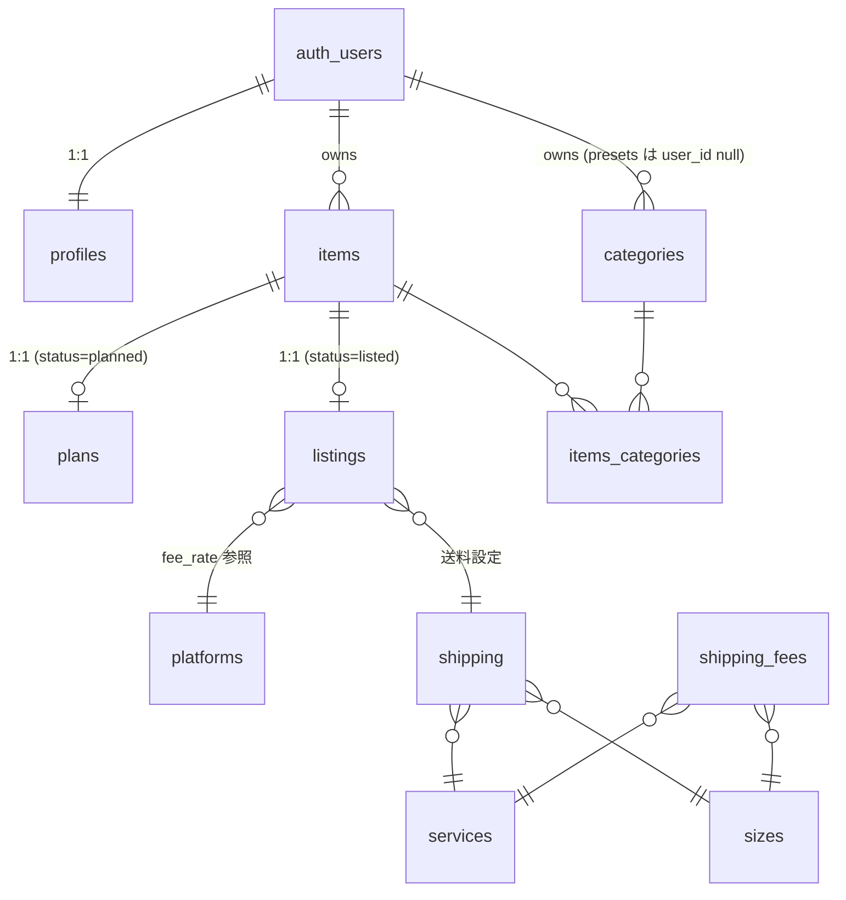

# mono-log DB 設計書

最終更新: 2026-05-30
対象スキーマ: `supabase/migrations/0002_v1_redesign.sql`（v1.1 再設計後）
マスタシード: `supabase/migrations/0003_seed_master.sql`

---

## 1. 概要

- DB: Supabase（PostgreSQL）
- スキーマ: `public`（アプリ用）／ `auth`（Supabase 管理）／ `storage`（Supabase 管理）
- セキュリティ: 全ユーザテーブルで RLS 有効。`(select auth.uid()) = user_id` ベースのポリシーで自分のデータのみ操作可能。マスタテーブル（platforms / services / sizes / shipping / shipping_fees）は認証済みユーザの SELECT のみ許可。
- ID 戦略: ユーザデータは `bigint generated always as identity`、マスタ系は `integer generated always as identity`、`profiles.id` のみ `bigint`。`auth.users.id` 参照キーは `uuid`。
- 共通カラム: `created_at` / `updated_at`（`timestamptz`、`updated_at` は共通トリガ `tg_set_updated_at` で自動更新）。

### items のステータス遷移

`item_status` enum で 1 アイテムの状態を管理する。

```
planned ──購入──▶ owned ──出品──▶ listed ──売却──▶ sold
```

- `planned`: 購入予定（1:1 で `plans` 行が存在）
- `owned`: 所有中
- `listed`: 出品中（1:1 で `listings` 行が存在）
- `sold`: 売却済み

`plans` / `listings` は遷移後も保持しうる（履歴目的）。1 行制約は `item_id` の UNIQUE で担保。

---

## 2. ER 図



---

## 3. テーブル一覧

| 種別 | テーブル | 主キー | 主な用途 |
| --- | --- | --- | --- |
| ユーザ | `profiles` | `id (bigint)` | `auth.users` と 1:1 のアプリ側プロフィール |
| ユーザ | `items` | `id (bigint)` | 物品本体（ステータスで購入予定／所有／出品中／売却済を区別） |
| ユーザ | `categories` | `id (integer)` | カテゴリ（プリセット + ユーザ追加） |
| ユーザ | `items_categories` | `(item_id, category_id)` | items × categories の M:N 中間表 |
| ユーザ | `plans` | `id (bigint)` | 購入予定の付随情報（items と 1:1） |
| ユーザ | `listings` | `id (bigint)` | 出品情報＋利益計算結果（items と 1:1） |
| マスタ | `platforms` | `id (integer)` | 出品プラットフォーム＋手数料率 |
| マスタ | `services` | `id (integer)` | 配送サービス名 |
| マスタ | `sizes` | `id (integer)` | 配送サイズ名 |
| マスタ | `shipping` | `id (bigint)` | サービス × サイズの組合せ（選択肢） |
| マスタ | `shipping_fees` | `id (bigint)` | サービス × サイズの送料 |

---

## 4. 列挙型

### `public.item_status`

```sql
create type public.item_status as enum ('planned', 'owned', 'listed', 'sold');
```

---

## 5. テーブル定義

### 5.1 `public.profiles`

`auth.users` の 1:1 拡張。サインアップ時に `handle_new_user` トリガで自動作成される。

| カラム | 型 | NOT NULL | 既定値 | 備考 |
| --- | --- | --- | --- | --- |
| `id` | `bigint` (identity) | ✓ | auto | PK |
| `user_id` | `uuid` | ✓ | — | UNIQUE / FK `auth.users(id)` ON DELETE CASCADE |
| `username` | `text` | ✓ | — | サインアップ時は `raw_user_meta_data->>'username'` → なければ email のローカル部 |
| `created_at` | `timestamptz` | ✓ | `now()` |  |
| `updated_at` | `timestamptz` | ✓ | `now()` | トリガで自動更新 |

- RLS: 自分の行のみ SELECT / INSERT / UPDATE 可。DELETE ポリシーは未定義（`auth.users` 削除時に CASCADE）。
- 自動作成: `auth.users` への INSERT 後トリガ `on_auth_user_created` → `public.handle_new_user()`（SECURITY DEFINER）。

### 5.2 `public.categories`

プリセット（`is_preset = true`, `user_id IS NULL`）とユーザ作成（`is_preset = false`, `user_id` 必須）を 1 つのテーブルで管理。

| カラム | 型 | NOT NULL | 既定値 | 備考 |
| --- | --- | --- | --- | --- |
| `id` | `integer` (identity) | ✓ | auto | PK |
| `user_id` | `uuid` | — | — | FK `auth.users(id)` ON DELETE CASCADE。プリセットは NULL |
| `name` | `text` | ✓ | — |  |
| `color` | `text` | ✓ | `'#94a3b8'` | カラーコード |
| `is_preset` | `boolean` | ✓ | `false` |  |
| `created_at` | `timestamptz` | ✓ | `now()` |  |
| `updated_at` | `timestamptz` | ✓ | `now()` | トリガで自動更新 |

- 制約:
  - `categories_owner_or_preset`: `(is_preset AND user_id IS NULL) OR (NOT is_preset AND user_id IS NOT NULL)`
  - UNIQUE `(user_id, name) NULLS NOT DISTINCT`: 同一ユーザ内で名前重複不可。プリセット同士も名前重複不可。
- インデックス: `categories_user_idx (user_id)`
- RLS: プリセットは全認証ユーザが SELECT 可。INSERT / UPDATE / DELETE は所有者のみ（INSERT で `is_preset = true` は不可）。

### 5.3 `public.items`

物品本体。ステータスにより付随表（plans / listings）の有無が決まる。

| カラム | 型 | NOT NULL | 既定値 | 備考 |
| --- | --- | --- | --- | --- |
| `id` | `bigint` (identity) | ✓ | auto | PK |
| `user_id` | `uuid` | ✓ | — | FK `auth.users(id)` ON DELETE CASCADE |
| `status` | `public.item_status` | ✓ | — | `planned` / `owned` / `listed` / `sold` |
| `name` | `varchar(255)` | ✓ | — |  |
| `image_url` | `text` | — | — | Storage `item-images` のパスを格納（後述） |
| `jan_code` | `varchar(13)` | — | — |  |
| `quantity` | `integer` | ✓ | — | CHECK `quantity > 0` |
| `notes` | `text` | — | — |  |
| `actual_price` | `integer` | — | — | 実購入価格。CHECK `>= 0` |
| `purchased_at` | `date` | — | — | 実購入日 |
| `deleted_at` | `timestamptz` | — | — | 論理削除タイムスタンプ |
| `created_at` | `timestamptz` | ✓ | `now()` |  |
| `updated_at` | `timestamptz` | ✓ | `now()` | トリガで自動更新 |

- インデックス:
  - `items_user_status_idx (user_id, status, created_at desc)`
  - `items_user_active_idx (user_id) WHERE deleted_at IS NULL`
- RLS: 所有者のみ SELECT / INSERT / UPDATE / DELETE 可。
- 仕様からの逸脱（承認済み）: `actual_price`（旧 `price_yen`）／`purchased_at`（旧 `purchase_date`）を保持。`tags` は廃止し、`items_categories` の M:N に統合。

### 5.4 `public.items_categories`

| カラム | 型 | NOT NULL | 既定値 | 備考 |
| --- | --- | --- | --- | --- |
| `item_id` | `bigint` | ✓ | — | FK `items(id)` ON DELETE CASCADE |
| `category_id` | `integer` | ✓ | — | FK `categories(id)` ON DELETE CASCADE |
| `created_at` | `timestamptz` | ✓ | `now()` |  |

- PK: `(item_id, category_id)`
- インデックス: `items_categories_category_idx (category_id)`
- RLS: 所有権は親 `items` から継承（`EXISTS` で `items.user_id = auth.uid()` チェック）。UPDATE ポリシーは定義しない（中間表のため SELECT / INSERT / DELETE のみ）。

### 5.5 `public.plans`

購入予定の付随情報。`status = planned` の `items` と 1:1。

| カラム | 型 | NOT NULL | 既定値 | 備考 |
| --- | --- | --- | --- | --- |
| `id` | `bigint` (identity) | ✓ | auto | PK |
| `item_id` | `bigint` | ✓ | — | UNIQUE / FK `items(id)` ON DELETE CASCADE |
| `planned_purchase_year` | `smallint` | — | — |  |
| `planned_purchase_month` | `smallint` | — | — | CHECK `between 1 and 12` |
| `list_price` | `numeric(10,0)` | — | — | 定価。CHECK `>= 0` |
| `purchase_price` | `numeric(10,0)` | — | — | 想定購入価格。CHECK `>= 0` |
| `product_url` | `text` | — | — |  |
| `deal_period` | `varchar(255)` | — | — | セール期間など |
| `created_at` | `timestamptz` | ✓ | `now()` |  |
| `updated_at` | `timestamptz` | ✓ | `now()` | トリガで自動更新 |

- RLS: 親 `items` の所有者のみ SELECT / INSERT / UPDATE / DELETE 可。

### 5.6 `public.listings`

出品情報＋利益計算結果。`status = listed` の `items` と 1:1。

| カラム | 型 | NOT NULL | 既定値 | 備考 |
| --- | --- | --- | --- | --- |
| `id` | `bigint` (identity) | ✓ | auto | PK |
| `item_id` | `bigint` | ✓ | — | UNIQUE / FK `items(id)` ON DELETE CASCADE |
| `shipping_id` | `bigint` | — | — | FK `shipping(id)` |
| `platform_id` | `integer` | — | — | FK `platforms(id)` |
| `quantity` | `integer` | — | — | CHECK `> 0` |
| `selling_price` | `numeric(10,0)` | — | — | CHECK `>= 0` |
| `packaging_cost` | `numeric(10,0)` | — | — | CHECK `>= 0` |
| `work_time_hours` | `numeric(8,2)` | — | — | CHECK `>= 0` |
| `labor_rate` | `numeric(10,0)` | — | — | 時給。CHECK `>= 0` |
| `selling_fee` | `numeric(10,0)` | — | — | ★アプリ計算値: `selling_price × platforms.fee_rate` |
| `work_time_cost` | `numeric(10,0)` | — | — | ★アプリ計算値: `work_time_hours × labor_rate` |
| `operating_benefit` | `numeric(10,0)` | — | — | ★アプリ計算値: 営業利益 |
| `ordinary_profit` | `numeric(10,0)` | — | — | ★アプリ計算値: 経常利益 |
| `is_listing` | `boolean` | — | — | 実際に出品中か |
| `created_at` | `timestamptz` | ✓ | `now()` |  |
| `updated_at` | `timestamptz` | ✓ | `now()` | トリガで自動更新 |

- ★印の 5 列は書き込み前にアプリ側で計算しセットする（DB トリガでの計算は行わない）。
- RLS: 親 `items` の所有者のみ SELECT / INSERT / UPDATE / DELETE 可。

### 5.7 `public.platforms`（マスタ）

| カラム | 型 | NOT NULL | 既定値 | 備考 |
| --- | --- | --- | --- | --- |
| `id` | `integer` (identity) | ✓ | auto | PK |
| `name` | `text` | ✓ | — | UNIQUE |
| `fee_rate` | `numeric(5,4)` | ✓ | — | CHECK `0 <= fee_rate <= 1` |
| `created_at` | `timestamptz` | ✓ | `now()` |  |
| `updated_at` | `timestamptz` | ✓ | `now()` | トリガで自動更新 |

- RLS: 認証済みユーザは SELECT のみ。

### 5.8 `public.services`（マスタ）

| カラム | 型 | NOT NULL | 既定値 | 備考 |
| --- | --- | --- | --- | --- |
| `id` | `integer` (identity) | ✓ | auto | PK |
| `shipping_service` | `text` | ✓ | — | UNIQUE |
| `created_at` / `updated_at` | `timestamptz` | ✓ | `now()` |  |

- RLS: 認証済みユーザは SELECT のみ。

### 5.9 `public.sizes`（マスタ）

| カラム | 型 | NOT NULL | 既定値 | 備考 |
| --- | --- | --- | --- | --- |
| `id` | `integer` (identity) | ✓ | auto | PK |
| `shipping_size` | `text` | ✓ | — | UNIQUE |
| `created_at` / `updated_at` | `timestamptz` | ✓ | `now()` |  |

- RLS: 認証済みユーザは SELECT のみ。

### 5.10 `public.shipping`

サービス × サイズの組合せ集合（選択肢一覧）。

| カラム | 型 | NOT NULL | 既定値 | 備考 |
| --- | --- | --- | --- | --- |
| `id` | `bigint` (identity) | ✓ | auto | PK |
| `shipping_service_id` | `integer` | ✓ | — | FK `services(id)` |
| `shipping_size_id` | `integer` | ✓ | — | FK `sizes(id)` |
| `created_at` / `updated_at` | `timestamptz` | ✓ | `now()` |  |

- UNIQUE `(shipping_service_id, shipping_size_id)`
- RLS: 認証済みユーザは SELECT のみ。

### 5.11 `public.shipping_fees`

サービス × サイズの送料。

| カラム | 型 | NOT NULL | 既定値 | 備考 |
| --- | --- | --- | --- | --- |
| `id` | `bigint` (identity) | ✓ | auto | PK |
| `shipping_service_id` | `integer` | ✓ | — | FK `services(id)` |
| `shipping_size_id` | `integer` | ✓ | — | FK `sizes(id)` |
| `fee` | `numeric(10,0)` | ✓ | — | CHECK `>= 0` |
| `created_at` / `updated_at` | `timestamptz` | ✓ | `now()` |  |

- UNIQUE `(shipping_service_id, shipping_size_id)`
- RLS: 認証済みユーザは SELECT のみ。

---

## 6. ストレージ

### バケット `item-images`

- 非公開（`public = false`）
- パス規約: `<user_id>/<item_id>/<filename>`
- RLS（`storage.objects`）: bucket 限定 + `storage.foldername(name)[1] = auth.uid()::text` で SELECT / INSERT / UPDATE / DELETE を所有者のみに制限。
- アプリ側からは署名付き URL でアクセス（`src/lib/image.ts`）。

---

## 7. 関数・トリガ

| 種別 | 名前 | 用途 |
| --- | --- | --- |
| Function | `public.tg_set_updated_at()` | `updated_at` を `now()` に更新する共通トリガ関数（`security invoker`, `search_path = ''`） |
| Trigger | `categories_set_updated_at` | `categories` の BEFORE UPDATE |
| Trigger | `items_set_updated_at` | `items` の BEFORE UPDATE |
| Trigger | `plans_set_updated_at` | `plans` の BEFORE UPDATE |
| Trigger | `listings_set_updated_at` | `listings` の BEFORE UPDATE |
| Trigger | `platforms_set_updated_at` | `platforms` の BEFORE UPDATE |
| Trigger | `services_set_updated_at` | `services` の BEFORE UPDATE |
| Trigger | `sizes_set_updated_at` | `sizes` の BEFORE UPDATE |
| Trigger | `shipping_set_updated_at` | `shipping` の BEFORE UPDATE |
| Trigger | `shipping_fees_set_updated_at` | `shipping_fees` の BEFORE UPDATE |
| Trigger | `profiles_set_updated_at` | `profiles` の BEFORE UPDATE |
| Function | `public.handle_new_user()` | `auth.users` の INSERT を受けて `profiles` を作成（`security definer`, `search_path = ''`） |
| Trigger | `on_auth_user_created` | `auth.users` の AFTER INSERT |

---

## 8. RLS ポリシー一覧（要約）

| テーブル | 対象ロール | SELECT | INSERT | UPDATE | DELETE |
| --- | --- | --- | --- | --- | --- |
| `profiles` | authenticated | 自分 | 自分 | 自分 | — |
| `categories` | authenticated | プリセット OR 自分 | 自分 かつ `is_preset = false` | 自分 | 自分 |
| `items` | authenticated | 自分 | 自分 | 自分 | 自分 |
| `items_categories` | authenticated | 親 items が自分 | 親 items が自分 | — | 親 items が自分 |
| `plans` | authenticated | 親 items が自分 | 親 items が自分 | 親 items が自分 | 親 items が自分 |
| `listings` | authenticated | 親 items が自分 | 親 items が自分 | 親 items が自分 | 親 items が自分 |
| `platforms` | authenticated | 全行 | — | — | — |
| `services` | authenticated | 全行 | — | — | — |
| `sizes` | authenticated | 全行 | — | — | — |
| `shipping` | authenticated | 全行 | — | — | — |
| `shipping_fees` | authenticated | 全行 | — | — | — |
| `storage.objects (item-images)` | authenticated | パス先頭 = 自分 | パス先頭 = 自分 | パス先頭 = 自分 | パス先頭 = 自分 |

- UPDATE ポリシーは `USING` と `WITH CHECK` を両方指定して行所有者の付け替えを防止。
- `auth.uid()` は `(select auth.uid())` 形式で評価し、行スキャン中の再評価を回避（Supabase 推奨パターン）。
- `service_role` は使用せず `anon` キーのみで運用。マスタの書き換えはダッシュボード / マイグレーションから行う前提。

---

## 9. シードデータ（`0003_seed_master.sql`）

### `platforms`

| name | fee_rate |
| --- | --- |
| メルカリ | 0.1000 |
| ラクマ | 0.0600 |
| Yahoo!フリマ | 0.0500 |
| Yahoo!オークション | 0.1000 |

### `services`

`らくらくメルカリ便` / `ゆうゆうメルカリ便` / `ヤマト宅急便` / `日本郵便（ゆうパック）`

### `sizes`

`ネコポス` / `ゆうパケット` / `宅急便コンパクト` / `60〜160 サイズ`

### `shipping_fees`

サービス × サイズの送料 24 行（2026-05 時点の概算）。詳細は `0003_seed_master.sql` を参照。

### `categories`（プリセット 9 件、`user_id = NULL`, `is_preset = true`）

電子機器 / 衣類 / 本・コミック / ホビー・おもちゃ / 家具・インテリア / 食品・飲料 / スポーツ / 美容・健康 / その他

---

## 10. 設計メモ

- 1 つの `items` に対し `plans` / `listings` は最大 1 行（`item_id` の UNIQUE で担保）。ステータス遷移後も付随表は残る可能性がある（履歴目的）。
- `items.deleted_at` で論理削除を表現。アクティブ抽出用に部分インデックス `items_user_active_idx` を用意。
- カテゴリは 1:N ではなく M:N（`items_categories`）。プロト時代の `items.category_id` / `tags` は廃止。
- `listings` の利益関連 5 列はアプリ計算値（書き込み時に算出してセット）。DB トリガでは計算しない。
- マスタ（platforms / services / sizes / shipping / shipping_fees）は全認証ユーザに SELECT のみ。更新はマイグレーションかダッシュボード経由。
- ストレージは非公開バケットで、所有者プレフィックス（`<user_id>/...`）でアクセスを限定。クライアントには署名付き URL を返す。
