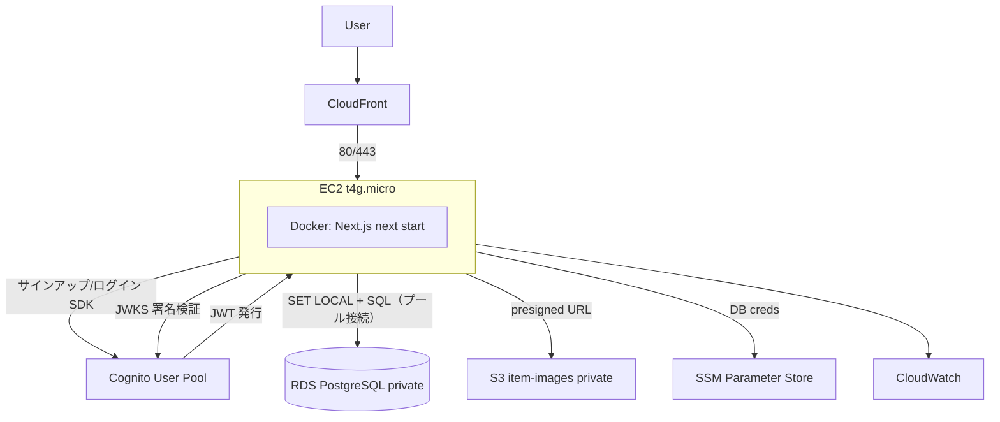
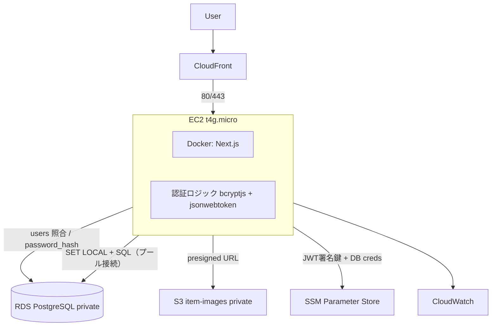

# mono-log インフラ設計書（AWS）

最終更新: 2026-06-09
対象アプリ: Next.js 15 (App Router) + React 19 + TypeScript / Server Actions
方針: **コスト最小（無料枠中心）** / DB は AWS（RDS）に移行 / **認証は Amazon Cognito（採用）** / **Docker コンテナ化して EC2 で運用（Fargate 移行可能）**

認証は **案A: Amazon Cognito 版を採用**する。案B（自作 JWT 版）は比較検討の記録として残す（面接でトレードオフを語るため）。

- **案A: Amazon Cognito 版**（マネージド認証・AWS ネイティブ）… ★**採用**
- **案B: 自作 JWT 版**（bcryptjs + jsonwebtoken・AWS 非依存）… 比較検討用・不採用

DB・ストレージ・ホスティング・監視などの基盤は **どちらの認証でも共通**。差分は「認証コンポーネント」のみ。

---

## 1. 前提と共通基盤

### 1.1 重視点

- 就活で **AWS 利用経験をアピール**することが主目的
- **無料枠中心**でコストを最小化（就活期間＝数ヶ月を実質 $0 で運用）
- 既存の Supabase スキーマ（`supabase/migrations/`）をほぼ流用
- **アプリは Docker でコンテナ化**し、コスト最小では **EC2 無料枠 1 台**で運用。スケール時は同じイメージを **ECS Fargate** へ移行できる設計にする

### 1.2 ホスティング方針：コンテナ化して EC2 運用（Fargate 移行可能）

```
今（コスト最小）                  将来（スケール時）
┌────────────────────┐           ┌─────────────────────┐
│ EC2 1台 (t4g.micro) │  ──────▶  │ ECS Fargate          │
│ Docker: next start  │  同じ      │ + ALB + Auto Scaling │
│ （12ヶ月無料枠）    │  イメージ  │ （同一 Docker image）│
└────────────────────┘           └─────────────────────┘
```

- **Dockerfile を作成**しアプリをコンテナ化（Next.js は `output: 'standalone'` で最小バンドル化）
- コスト最小フェーズは **EC2 1 台で `docker run`**（無料枠）
- 同じイメージが Fargate でもそのまま動くため、**「コンテナ化済み＝Fargate 移行可能」**を設計書・口頭でアピールできる
- ※ ECS/Fargate は今回は採用しない（Fargate は無料枠が無く、ポートフォリオ規模では過剰）。**拡張パスとして記録するに留める**

ホスティング選択肢の比較は[第 4 章](#4-ホスティング選択肢の比較）を参照。

### 1.3 Supabase → AWS マッピング（共通）

| 現状 (Supabase) | AWS 置き換え | 無料枠 |
| --- | --- | --- |
| Postgres + RLS | **RDS for PostgreSQL** `db.t4g.micro` Single-AZ | 750h/月・20GB（12ヶ月） |
| Storage（署名付きURL） | **S3**（非公開）+ presigned URL | 5GB・2万GET/月（12ヶ月） |
| ホスティング | **EC2 `t4g.micro` 上で Docker コンテナ（`next start`）** | 750h/月（12ヶ月） |
| 配信 / TLS | **CloudFront**（CDN・TLS・静的キャッシュ） | 1TB/月（恒久） |
| DB 認証情報 | **SSM Parameter Store**（SecureString） | 標準パラメータ無料 |
| ログ・監視 | **CloudWatch** | 5GBログ・10メトリクス（恒久） |
| 認証 | **案A: Cognito / 案B: 自作 JWT** | （後述） |

### 1.4 ネットワーク（共通）

```
VPC 10.0.0.0/16
├─ public  subnet a: EC2（Docker コンテナ / next start）＋ Elastic IP
├─ private subnet a: RDS (AZ-a)
├─ private subnet c: RDS 予備 (AZ-c, Multi-AZ 化に備える)
└─ Internet Gateway: EC2 から S3/SSM/Cognito へは public AWS エンドポイント経由
```

- **EC2 は public subnet**（Internet Gateway 経由で外部 AWS API に到達）。NAT Gateway 不要（$32/月〜を回避）
- **RDS は private subnet**（インターネット非公開）。Security Group で「EC2 の SG からの 5432 のみ許可」
- EC2 の Security Group は **CloudFront からの 80/443 のみ許可**（CloudFront マネージドプレフィックスリスト）に絞り、直接アクセスを遮断

### 1.5 接続の利点（EC2 採用のポイント）

- **Lambda と違い常駐プロセス**なので、RDS へのコネクションを**プールして再利用**できる。Lambda 版で問題になる「同時実行ごとの接続枯渇」が起きない（reserved concurrency や RDS Proxy が不要）
- `next start`（standalone server）を**そのまま起動**でき、OpenNext のような変換アダプタが不要 → Next.js フル互換

### 1.6 認可（RLS）の再設計 ※両案共通

素の RDS には Supabase の「JWT → `auth.uid()` 自動連携」が無いため、認可を再設計する。

**採用方針: Postgres RLS を維持**

1. アプリ（EC2 上のコンテナ）が JWT を検証し、ユーザID（`sub`）を取得
2. トランザクション開始時に `SET LOCAL app.current_user_id = '<sub>'`
3. RLS ポリシーを `current_setting('app.current_user_id') = user_id` に書き換え

→ DB レイヤで多層防御（BOLA 対策）を維持。**「Cognito でも自作でも、認可ロジックは共通」**にできる。

---

## 2. 案A: Amazon Cognito 版 … ★採用

### 2.1 構成図

```
                         ┌─────────────┐
        ユーザー ──────▶ │  CloudFront │ (CDN / TLS / 静的キャッシュ)
                         └──────┬──────┘
                                │ 80/443（CloudFront からのみ許可）
                                ▼
                ┌──────────────────────────────┐
                │ EC2 (public subnet, t4g.micro)│
                │ ┌──────────────────────────┐ │
                │ │ Docker コンテナ           │ │
                │ │  Next.js (next start)     │ │
                │ │  SSR / Server Actions     │ │
                │ └──────────────────────────┘ │
                └───────┬───────────┬──────┬────┘
            ┌───────────┘           │      └────────────┐
            ▼                       ▼                   ▼
   ┌───────────────┐       ┌──────────────┐    ┌─────────────┐
   │ Cognito       │       │ RDS Postgres │    │ S3          │
   │ User Pool     │       │ t4g.micro    │    │ item-images │
   │ - サインアップ│       │ (private)    │    │ (private)   │
   │ - ログイン    │       └──────────────┘    └─────────────┘
   │ - JWT 発行    │        SET LOCAL + SQL      presigned URL
   │ - メール確認  │
   │ - PWリセット  │     ┌─────────────┐
   └───────────────┘     │ SSM Param   │  DB認証情報
     ↑ JWKS で署名検証   │ Store       │
                         └─────────────┘
```



### 2.2 認証フロー

1. ユーザーがサインアップ → Cognito がパスワードをハッシュ保管・確認メール送信
2. ログイン → Cognito が **ID/アクセストークン（JWT）＋リフレッシュトークン**を発行
3. アプリは JWT を httpOnly Cookie に保存
4. Server Action は Cognito の **JWKS 公開鍵**で JWT 署名を検証 → `sub` 取得
5. `SET LOCAL app.current_user_id = sub` で RDS にユーザを伝え、RLS が効く

### 2.3 担当範囲

| 機能 | 担当 |
| --- | --- |
| パスワードハッシュ化 | **Cognito** |
| メール確認 / パスワードリセット | **Cognito** |
| MFA / アカウントロック | **Cognito**（設定で有効化） |
| リフレッシュトークン回転 | **Cognito** |
| JWT 検証 | アプリ（JWKS 取得して検証） |
| 認可（RLS） | アプリ + RDS |

### 2.4 長所 / 短所

- **長所**: 認証の重い部分を AWS に委譲・実装量小・無料枠潤沢（50,000 MAU/月）・**AWS スキルを直接アピール**
- **短所**: Cognito の癖（属性・トリガ Lambda 等）の学習コスト・ベンダーロック

---

## 3. 案B: 自作 JWT 版（bcryptjs + jsonwebtoken） … 比較検討用・不採用

> 本案は採用しない。Cognito との比較対象として記録する（実装量・セキュリティ責任の大きさを示すため）。

### 3.1 構成図

```
                         ┌─────────────┐
        ユーザー ──────▶ │  CloudFront │ (CDN / TLS / 静的キャッシュ)
                         └──────┬──────┘
                                │ 80/443（CloudFront からのみ許可）
                                ▼
              ┌──────────────────────────────────┐
              │ EC2 (public subnet, t4g.micro)    │
              │ ┌──────────────────────────────┐ │
              │ │ Docker コンテナ Next.js       │ │
              │ │ ┌──────────────────────────┐ │ │
              │ │ │ 認証ロジック内蔵         │ │ │
              │ │ │  - bcryptjs              │ │ │
              │ │ │  - jsonwebtoken          │ │ │
              │ │ └──────────────────────────┘ │ │
              │ └──────────────────────────────┘ │
              └───────┬───────────────┬──────┬───┘
                      │               │      └────────────┐
                      ▼               ▼                   ▼
              ┌───────────────┐ ┌──────────┐     ┌─────────────┐
              │ RDS Postgres  │ │（同 RDS） │   │ S3          │
              │ users テーブル │ │ items 等  │   │ item-images │
              │ password_hash │ └──────────┘     └─────────────┘
              └───────────────┘
                認証情報も RDS    ┌─────────────┐
                                  │ SSM Param   │ JWT署名鍵
                                  │ Store       │ + DB認証情報
                                  └─────────────┘
```



### 3.2 認証フロー

1. サインアップ → アプリが **bcryptjs** でパスワードをハッシュ化 → RDS の `users` テーブルに保存（確認メール送るなら SES を別途追加）
2. ログイン → bcryptjs でハッシュ照合 → **jsonwebtoken** でアクセストークン＋リフレッシュトークンを発行（署名鍵は SSM SecureString）
3. アクセストークンを httpOnly Cookie、リフレッシュトークンも httpOnly Cookie（回転管理は自前で実装）
4. Server Action は jsonwebtoken で署名検証 → `sub` 取得
5. `SET LOCAL app.current_user_id = sub` で RLS（案A と同じ）

### 3.3 担当範囲（＝自前で実装するもの）

| 機能 | 担当 |
| --- | --- |
| パスワードハッシュ化 | **自前**（bcryptjs） |
| メール確認 / パスワードリセット | **自前**（要 SES 追加・トークン管理） |
| MFA / アカウントロック | **自前**（実装しないことが多い） |
| リフレッシュトークン回転 | **自前**（DB にトークン保存・失効管理） |
| JWT 発行・検証 | **自前**（jsonwebtoken） |
| 認可（RLS） | アプリ + RDS |

### 3.4 追加で必要になるもの

- `users` テーブル（`email`, `password_hash`, `created_at` …）を RDS に新設
- リフレッシュトークン管理テーブル（回転・失効のため）
- JWT 署名鍵（HS256 の共有秘密 or RS256 の鍵ペア）を **SSM SecureString** で管理
- 確認メール / リセットを実装するなら **Amazon SES**（無料枠: 3,000通/月相当）

### 3.5 長所 / 短所

- **長所**: AWS 非依存でどこでも動く・**認証の仕組みを理解しているアピール**・ベンダーロック無し
- **短所**: **実装量とセキュリティ責任が大きい**（トークン回転・タイミング攻撃・メールフロー）・bcryptjs は pure JS で低速（native `bcrypt`/`argon2` はビルド注意）・AWS の認証スキルはアピールできない

---

## 4. ホスティング選択肢の比較

採用は **EC2 1 台 + Docker**。他案との比較を記録しておく（面接でトレードオフを語るため）。

| 観点 | **EC2 1台 + Docker（採用）** | Lambda (OpenNext) | ECS Fargate | App Runner |
| --- | --- | --- | --- | --- |
| コスト最小 | ◎ 12ヶ月無料枠 | ◎ ほぼ$0（スケールゼロ） | ✕ 約$10/月〜（無料枠なし） | △ 約$5〜/月 |
| Docker/コンテナ経験 | ○（イメージ作成・運用） | ✕ | ◎ | ○ |
| RDS接続の楽さ | ◎ プール接続 | △ 枯渇対策が必要 | ◎ | ◎ |
| Next.js 互換 | ◎ `next start` 素直 | △ 変換アダプタに癖 | ◎ | ◎ |
| 運用の手間 | 中（OS更新・プロセス監視） | 小 | 中 | 小 |
| コールドスタート | なし | あり | なし | あり |
| 就活での需要 | 高（EC2 は王道）＋ Docker | 高（モダン） | 高（コンテナ需要大） | 中 |

### 採用理由

1. **コンテナ化（Docker）スキルを示しつつ無料枠で運用**できる（Fargate は無料枠が無いため今回は不採用）
2. **RDS 接続がプールで楽**（Lambda の接続枯渇問題を回避）
3. **`next start` をそのまま動かせる**（OpenNext 不要）
4. **同一イメージで Fargate へ移行可能**＝拡張パスを保ったまま最小コスト

---

## 5. コスト試算（東京リージョン・小規模）

| 項目 | 12ヶ月以内 | 12ヶ月以降の目安 |
| --- | --- | --- |
| EC2 `t4g.micro` 1台 | $0（無料枠 750h/月） | 約 $6〜8/月 |
| CloudFront / Cognito / CloudWatch / SSM | $0 | $0〜数百円 |
| RDS `db.t4g.micro` Single-AZ 20GB | $0（無料枠） | 約 $13〜15/月 |
| S3（画像 数GB） | $0（無料枠） | 数十円 |
| SES（案B でメール送る場合） | $0（無料枠内） | ほぼ $0 |
| Route 53（独自ドメイン使う場合のみ） | $0.50/月 | $0.50/月 |
| **合計** | **ほぼ $0** | **約 $20〜24/月**（EC2 + RDS が主因） |

> 就活期間（数ヶ月）は無料枠内で実質 $0。12ヶ月後は EC2 と RDS が固定費。
> 「Single-AZ・NAT 回避・SSM（Secrets Manager 不使用）・1台運用」をコストを理解して選んだ、と説明できる。

---

## 6. 本番グレードへの拡張余地（面接で語れるトレードオフ）

| 項目 | コスト最小版 | 本番グレード |
| --- | --- | --- |
| コンピュート | EC2 1台 + Docker | **ECS Fargate**（同一イメージ）+ ローリング更新 |
| 可用性（アプリ） | EC2 1台 | **ALB + Auto Scaling Group**（マルチ AZ・自動復旧） |
| DB 可用性 | Single-AZ | **Multi-AZ**（自動フェイルオーバー） |
| シークレット | SSM Parameter Store | **Secrets Manager**（自動ローテーション） |
| 監視 | CloudWatch 基本 | **X-Ray** 分散トレース + ダッシュボード |
| エッジ防御 | なし | **AWS WAF**（CloudFront 前段） |

> コンテナ化済みのため、コンピュートは **EC2 → Fargate** に差し替えるだけでスケール構成へ移行できる（イメージは共通）。

---

## 7. 次のステップ

1. 2 案のどちらを実装するか（または両方を段階的に）を決定
2. **Dockerfile 作成**（Next.js `output: 'standalone'` でマルチステージビルド）
3. IaC ツール選定（候補: AWS CDK (TypeScript) / Terraform）
4. 既存スキーマの RLS を `current_setting('app.current_user_id')` ベースへ移植
5. EC2 への Docker デプロイ手順を確立（`docker run` / docker compose）
6. CI/CD（GitHub Actions + OIDC、静的キーなし → ECR push → EC2 pull）を構築

---

## 8. 実装ロードマップ（AWS 操作の発生工程）

### 8.1 AWS 操作の3つの方法

| 方法 | 内容 | 向き | 就活アピール |
| --- | --- | --- | --- |
| マネジメントコンソール（GUI） | ブラウザで操作 | 学習・動作確認 | 低 |
| AWS CLI | コマンドで単発操作 | スクリプト・小回り | 中 |
| **IaC（CDK / Terraform）** | インフラをコードで定義 | 再現性・本番 | **高** |

> 方針: 最初に1度コンソールで触って理解 → **本番リソースは IaC で作る**。
> そのため **IaC 選定（Phase 2）を AWS リソース作成より先**に行う（後だと手作業を書き直す二度手間になる）。

### 8.2 工程別ロードマップ

| Phase | 工程 | AWS操作 | 主な方法 |
| --- | --- | --- | --- |
| 0 | **ローカル準備**（Dockerfile、`output:standalone`、RLSの`SET LOCAL`移植、ローカルPostgresで検証） | **なし** | ローカルのみ |
| 1 | **アカウント基盤**（IAMユーザ/ロール、CLI設定、リージョン） | あり（開始点） | コンソール + CLI |
| 2 | **IaC 選定・雛形作成**（CDK or Terraform） | あり | **IaC** |
| 3 | **ネットワーク**（VPC / subnet / Security Group / IGW） | あり | **IaC** |
| 4 | **データ層**（RDS / S3 / SSM Parameter Store） | あり | IaC ＋ 手動/CLI |
| 5 | **認証**（Cognito User Pool / App Client） | あり | **IaC** |
| 6 | **コンピュート/配信**（ECR / EC2 / CloudFront） | あり | IaC ＋ EC2上で`docker` |
| 7 | **CI/CD**（GitHub Actions OIDC → ECR push → EC2 pull） | あり | IaC ＋ GitHub設定 |

- **AWS 操作なし**: Phase 0（Dockerfile・アプリ・RLS 移植は完全ローカル）
- **AWS 操作の中心**: Phase 2〜6（**IaC で一括構築** → `cdk deploy` / `terraform apply`）＝就活で語る主役
- **手動/CLI が残る部分**:
  - SSM へ機密投入（コードに秘密を書かないため）
    例: `aws ssm put-parameter --name /monolog/db/password --type SecureString --value ...`
  - RDS へスキーマ適用（`psql` で既存マイグレーションを流用）
  - EC2 上で初回 `docker pull` / `docker run`（以降は CI/CD が自動化）

### 8.3 構築フロー図

```
Phase 0: ローカル（AWS操作なし）
   Dockerfile / アプリ / RLS移植 / ローカル動作確認
        │
        ▼
Phase 1-2: AWSアカウント準備 → IaCツール選定
        │
        ▼
Phase 3-6: IaC コード（CDK/Terraform）
        │  cdk deploy / terraform apply
        ▼
   AWS にリソース一括作成（VPC, RDS, Cognito, EC2, CloudFront, IAM…）
        │
        ├─ 手動/CLI: SSMにシークレット投入、RDSにスキーマ適用
        └─ EC2: docker pull → run
        │
        ▼
Phase 7: CI/CD で以降のデプロイを自動化（GitHub Actions → ECR → EC2）
```
